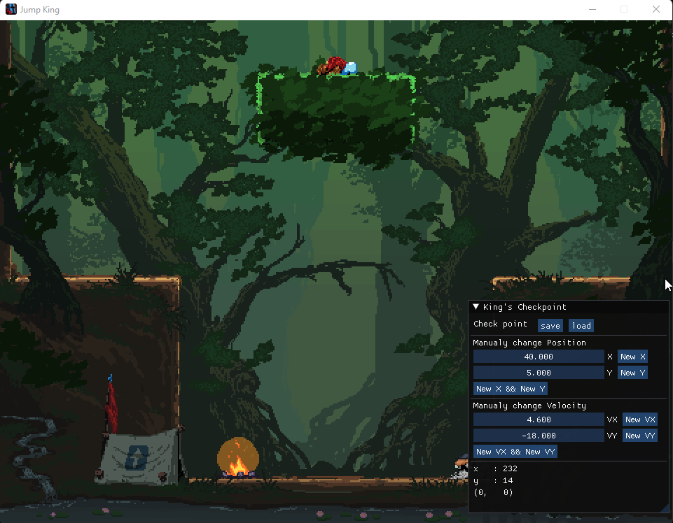

# JumpKingCheckpoint
Little tool kit to help you enjoy JumpKing another way. Save and load your position and more.

## What's inside ?
* A checkpoint system
* You can modify your position by dragging the sliders and click a button
* You can make you character jump with your desired power

## Download
If you just want the executable click [here](https://github.com/ChevalierSoft/Jump_King_Checkpoint/releases) (windows only)

Your antivirus might not like it. If you don't trust it you can compile it yourself using the source code and Visual Studio.

## Built With
* [ImGui v1.83](https://github.com/ocornut/imgui) - Dear ImGui: Bloat-free Immediate Mode Graphical User interface for C++ with minimal dependencies
* [DirectX Software Development Kit](https://www.microsoft.com/en-us/download/details.aspx?id=6812) - This DirectX SDK release contains updates to tools, utilities, samples, documentation, and runtime debug files for x64 and x86 platforms.
* [Visual Studio](https://visualstudio.microsoft.com/) - Fat IDE you need to compile this code.

## Many thanks to
* [Majdev](https://github.com/inc-Majdev) [UI template]
* 50 kind souls on various forums
